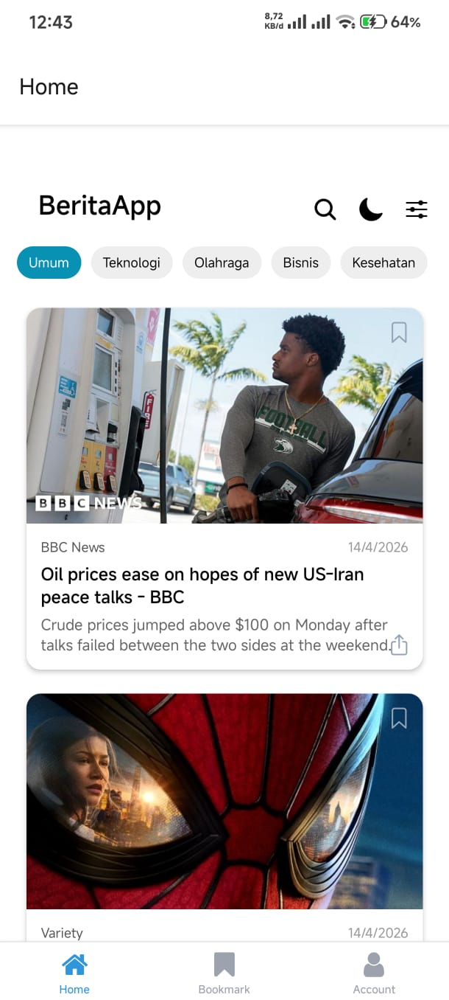
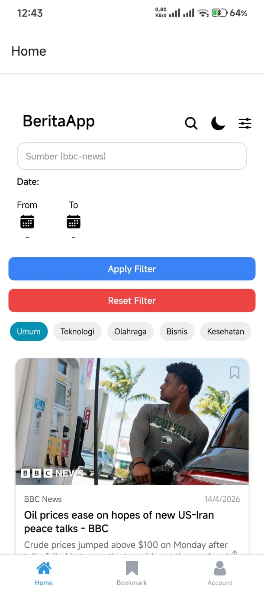
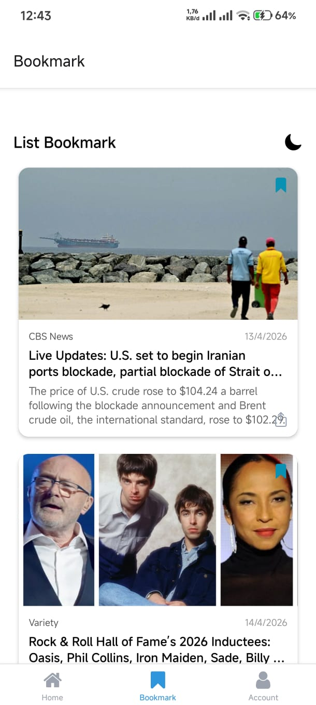
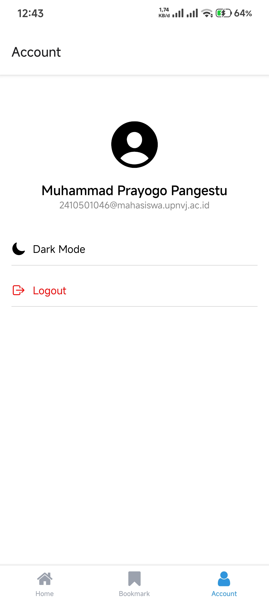

# Berita App - Pengayaan minggu ke 6

## Informasi Mahasiswa

- Nama : Muhammad Prayogo Pangestu
- NIM : 2410501046

## Deskripsi Aplikasi

Berita App adalah apllikasi berbasis react native yang berfungsi untuk menampilkan list berita dari berbagai kaetegori menggunakan REST API (NewsApi). Aplikasi ini memungkinkan pengguna dapat menggunakan fitur fitru seperti mencari berita, memfilter berita berdasarkan sumber dan tangggal, dan dapat menyimpannya dalam bookmark

## Teknologi yang Digunakan

- React Native (Expo)
- TypeScript
- React Query (TanStack Query)
- AsyncStorage
- Expo Router
- NewsAPI (REST API)

## Fitur Utama

- Search Berita
  - Mencari berita berdasarkan kata kunci
  - Menggunakan debounce untuk menghindari request berlebihan

- Filter Berita
  - Filter berdasarkan:
    - Sumber berita (source)
    - Rentang tanggal (from - to)
  - Menggunakan tombol Apply Filter untuk kontrol request

- Bookmark
  - Menyimpan artikel ke AsyncStorage
  - Dapat diakses kembali secara offline

- Dark Mode
  - Toggle dark/light mode menggunakan React Context

- Navigasi Tab
  - Home
  - Bookmark
  - Account

- \*UI Interaktif
  - Header dengan icon (search, filter, theme)
  - Date picker untuk memilih tanggal
  - Loading & error handling

## Screenshot

Berikut tampilan aplikasi:

### Home Screen

### Bookmark Screen

### Account Screen

## Cara Menjalankan

- npm install
- Buat file .env
  NEWS_API_KEY=your_api_key
  EWS_API_BASE_URL=https://newsapi.org/v2
- npx expo start
