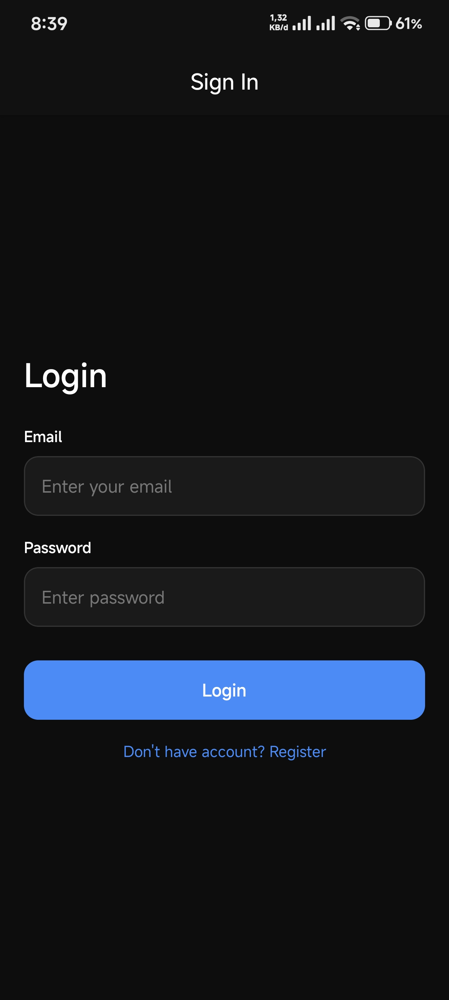
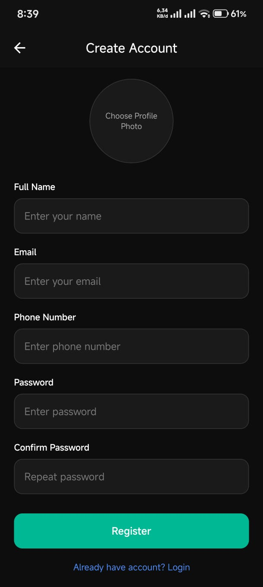

# Form Input App - Pertemuan 7

## Informasi Mahasiswa

- Nama : Muhammad Prayogo Pangestu
- Nim : 2410501046
- Program Studi : D3 Sistem Informasi

## Deskripsi Aplikasi

Form Input App adalah aplikasi berbasis React Native yang menyediakan fitur login dan registrasi dengan validasi form, upload foto profil, navigasi antar halaman, serta pengelolaan input yang optimal untuk perangkat mobile.

## Teknologi yang Digunakan

- React Native (Expo)
- JavaScript
- Formik
- Yup
- React Navigation
- Expo Image Picker

## Fitur Utama

- Login Form
  - Input email dan password
  - Validasi menggunakan Formik + Yup
  - Error handling jika login gagal
  - Navigasi ke Home Screen setelah berhasil login

- Register Form
  - Input nama, email, nomor HP, password, dan konfirmasi password
  - Upload foto profil dari galeri
  - Validasi penuh menggunakan Yup Schema

- Custom Components
  - Komponen FormInput reusable
  - Menampilkan error message per field
  - Border input berubah saat error

- Keyboard & UX
  - KeyboardAvoidingView agar form tidak tertutup keyboard
  - ScrollView untuk form panjang
  - Keyboard.dismiss() saat tap di luar input

- Navigation Flow
  - Login Screen
  - Register Screen
  - Home Screen
  - Logout kembali ke Login

## Screenshot

Berikut tampilan aplikasi:

### Login Screen

### Register Screen

## Cara Menjalankan

- npm install
- npx expo start

- Gunakan akun berikut untuk mencoba fitur login:
  - Email : admin@gmail.com
  - Password : 123456
